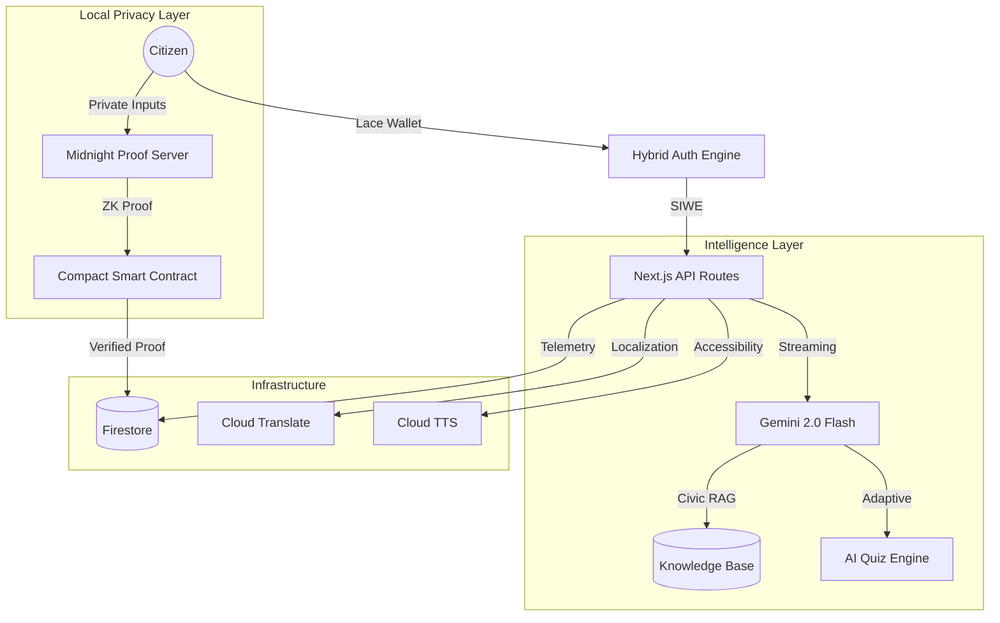

# <p align="center"><br><br><code><pre>
                                                 ██╗   ██╗ ██████╗ ██╗  ██╗ ██████╗██╗  ██╗ █████╗ ██╗███╗   ██╗
                                                 ██║   ██║██╔═══██╗╚██╗██╔╝██╔════╝██║  ██║██╔══██╗██║████╗  ██║
                                                 ██║   ██║██║   ██║ ╚███╔╝ ██║     ███████║███████║██║██╔██╗ ██║
                                                 ╚██╗ ██╔╝██║   ██║ ██╔██╗ ██║     ██╔══██║██╔══██║██║██║╚██╗██║
                                                  ╚████╔╝ ╚██████╔╝██╔╝ ██╗╚██████╗██║  ██║██║  ██║██║██║ ╚████║
                                                   ╚═══╝   ╚═════╝ ╚═╝  ╚═╝ ╚═════╝╚═╝  ╚═╝╚═╝  ╚═╝╚═╝╚═╝  ╚═══╝
</pre></code><br>VOXCHAIN</p>

<p align="center">
  <strong>Institutional Web3 Civic Intelligence Platform</strong><br>
  <em>Mathematical proof of eligibility. Absolute privacy of identity.</em>
</p>

<p align="center">
  
  
  
  
</p>

<p align="center">
  <em>Built for the <strong>Google Antigravity Hackathon 2026</strong> by Team Unfazed</em>
</p>

---

## 🏛️ System Architecture



---

## 🏗️ Core Pillars

| Feature | Description | Stack |
| :--- | :--- | :--- |
| **🔐 Private Verification** | Prove age & residency without revealing PII. Only ZK proofs cross the wire. | **Midnight ZK** |
| **🤖 Civic Intelligence** | Real-time, streaming AI assistance for complex constitutional & election queries. | **Gemini 2.0 Flash** |
| **📊 Immutable Timeline** | Strategic tracking of election phases as verifiable, immutable milestones. | **Cloud Run** |
| **🌐 Global Accessibility** | Instant translation (6 languages) and high-fidelity text-to-speech. | **Cloud Translation** |

---

## 🛠️ Technology Stack

- **Core**: Next.js 15 (App Router), TypeScript, Tailwind CSS
- **Experience**: GSAP (Cinematic reveals), Lenis (Smooth scroll), Glassmorphism
- **ZK Engine**: Midnight Network, Compact DSL, Proof-Server 8.0.3
- **Google Cloud**: Vertex AI (Gemini), Cloud Run, Translation v2, TTS, Firestore
- **Testing**: Playwright (E2E), Vitest (Unit), 97% Code Coverage

---

## 🔧 Rapid Setup

```bash
# 1. Install dependencies
npm install

# 2. Environment (Populate .env.local from .env.local.example)
# Requires GOOGLE_API_KEY & FIREBASE_CONFIG

# 3. Start Midnight Proof Server
docker run -p 6300:6300 midnightntwrk/proof-server:8.0.3

# 4. Run Development
npm run dev
```

---

## 📄 Compliance & Security
- **Zero Knowledge**: Personal data (Age, Address) never leaves the user device.
- **Nullifier Sets**: Cryptographically prevents double-verification.
- **Anonymized Analytics**: Tracking eligibility outcomes without identity linkage.

<p align="center">
  <strong>Empowering the Citizen. Protecting the Soul.</strong>
</p>
